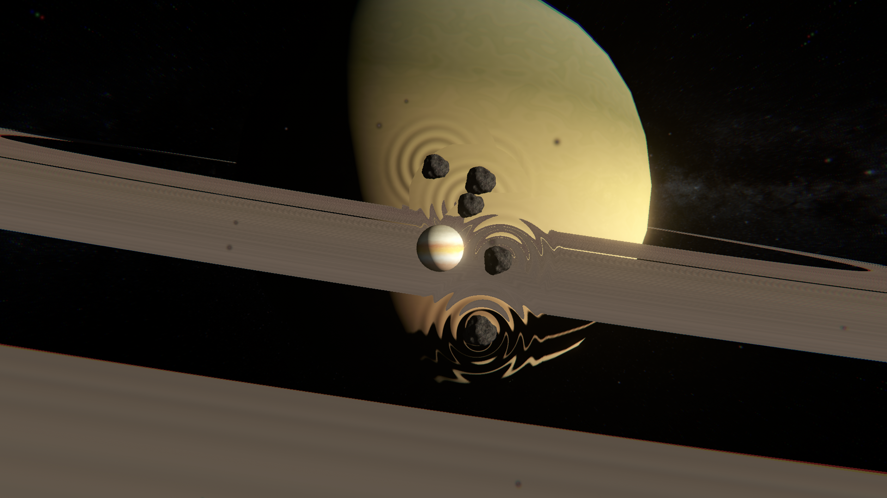

# From-Saturns-rings_GMTK-2021
 This project was made in less than 48 hours for the GameMaker's toolkit 2021 game jam using Unity 2021.1.11f1

 A Windows build can be downloaded from the [releases section](https://github.com/Noobot9k/From-Saturns-rings/releases)
 Play in your web browser or download the Windows build on [Itch](https://pc-hris.itch.io/from-saturns-rings)

 I experimented with custom shaders that distort the world behind them and creating the feeling of being in outer space at the mercy of the gravity of nearby bodies.

 I'm graphically pretty pleased with the outcome though the post processing doesn't work on the web version due to technical limitations.

 In terms of gameplay, I think I could have made the gravity mechanic less confusing and made it easier for the player to identify how fast they were moving and in what direction. The gameplay could also be more interesting.

 ### Images
 
 .png)
 .png)
